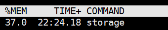
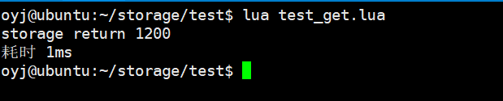

# Storage

__这是一个造轮子的项目，正如费曼的一句话，“凡是我不能创造的我就不能理解”，这个项目当时也是突发奇想，原本准备直接硬读Redis源码，后来偶然间读到了费曼大佬的这句话，我茅塞多开，与其毫无目的的看源码，不如自己造一个Redis，在造轮子的过程中去阅读，参考Redis的实现不更有意思吗？__

__目前项目整体框架已经搭建完毕，虽然还是很粗糙，但毕竟本人萌新，还望多多谅解，嗯~，现在就是总体能跑，所以打算放在全球最大的同性交友平台托管，献丑了__

### 简介
__Storage的数据结构的实现使用了Linux内核中的侵入式数据结构，目前实现的数据结构有散列表、AVL树、有序列表；整个项目分为多个模块分别为，并发模块，io模块，命令处理模块，资源管理模块，参考Skynet的消息actor模式，整个响应模型被独立成两个actor，他们之间维护各自的消息队列用来通信，总体来说照虎画猫吧__

### 运行它
    使用makefile
    make && cd bin
    
    或者使用cmake
    ./start.sh
    cd bin
    
    然后在bin目录运行
    ./Storage

### 测试
__在test文件夹下有相关测试的lua脚本，所需要的驱动库在historage目录下，你编译成动态库去引用它；在目前的测试中，一百万数据下内存使用为1.4G（4G的虚拟机内存）__

    
__get命令在大量请求下处理时间平均两毫秒，偶尔会有抖动，但都在20ms以下，因为是本机测试，所以没有网络延迟__

    
__在10000并发，平均每个连接发送500请求下，测试结果为连接耗时平均最大1ms，请求最大耗时为112ms，具体请求响应时间都是在客户端记录__

    
### 后续的计划
__目前感觉代码还是十分丑陋，后续会不断优化它，还会不断加入新的数据结构，为Storage添加新的命令，还会考虑做持久化，由于平常需要打工谋生，只有周日有时间，所以进度会非常缓慢，再加上本人最近沉迷与golang无法自拔，但不管怎么样，先吹个牛！加油吧！__
